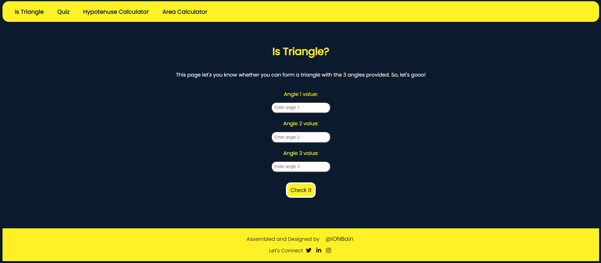
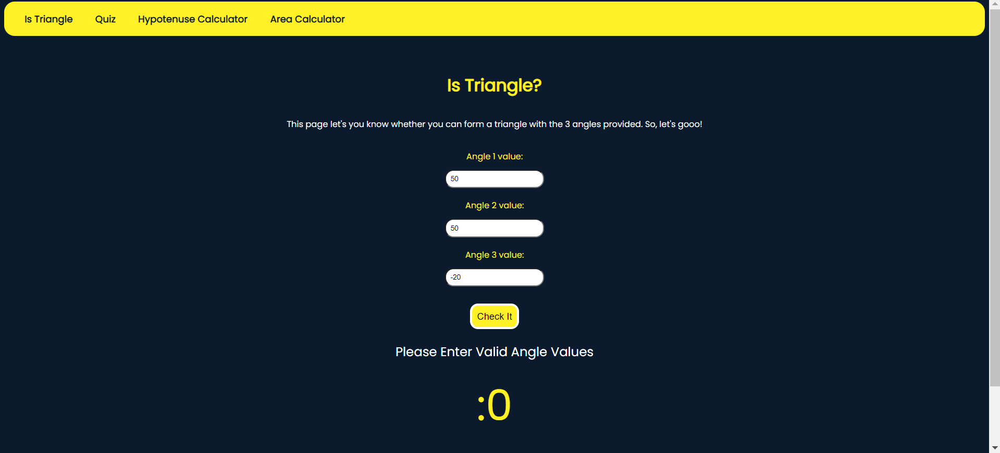
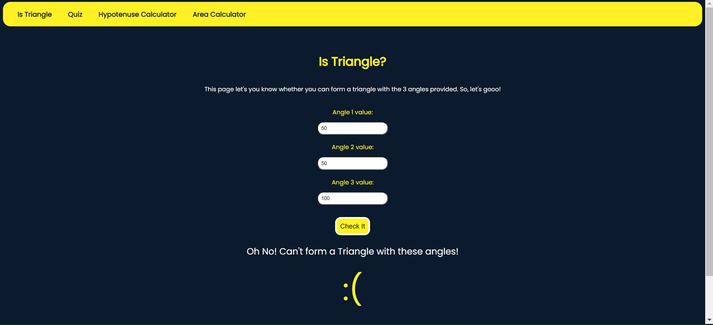

# Fun with Triangles
An app that tells you how much money you made or lost in stock market. 

>Colored outputs are being shared based on "profit" scenario or "loss" scenario or "no profit no loss" scenario

Here are a few project-related insight pictures:

1. Landing Page 

2. Is Triangle validator - Here, if user enters the 3 angles, the webapp tells us if we can form a triangle or not. In this case, we can for a triangle !

3. Is Triangle validator - Validating and handling for -ve values of angles

4. Is Triangle validator - Here, if user enters the 3 angles, the webapp tells us if we can form a triangle or not. In this case, we cannot for a triangle.

5. Quiz on Triangles - We select the answers and hit submit to check our score 

6. Quiz on Triangles - If we don't select any answers, our score will be zero, no negative marking here :)

5. Hypotenuse Calculator - If we provide with height and base of a right angled triangle, webapp will provide with the hypotenuse of the same triangle. 

6. Hypotenuse Calculator - Handling negative and blank values in the calculator

Area calculator is also there ! Pls visit the website by [clicking here.](https://fun-with-triangles-ba.netlify.app/area-index.html)
> Technologies/Libraries used :-
* Vanilla Javascript
* CSS
* HTML

> Platform used to develop project :-
* [Visual Studio Code](https://code.visualstudio.com/)
> Platform used to host and deploy the project :-
* [Github.com](https://github.com/ionbain)
* [Netlify.com](https://app.netlify.com/teams/bhaskartx/)

